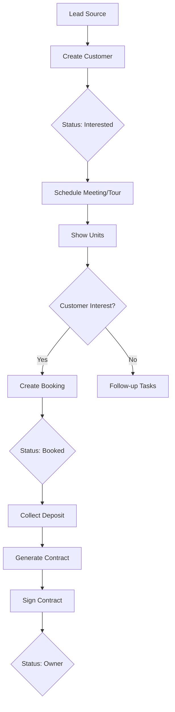

# Nokhbat Almabani Admin Panel
## Information Architecture & User Flow Documentation

---

## 📋 Table of Contents

1. [Project Overview](#project-overview)
2. [System Architecture](#system-architecture)
3. [Navigation Structure](#navigation-structure)
4. [Module Breakdown](#module-breakdown)
5. [User Flows](#user-flows)
6. [Data Models](#data-models)
7. [Design System](#design-system)

---

## 🏗️ Project Overview

**Nokhbat Almabani** (نخبة المباني) is a comprehensive real estate management admin panel designed for managing residential and commercial property development projects in Saudi Arabia. The system supports **bilingual content** (Arabic/English) with **RTL support**.

### Key Features
- Multi-project management with buildings and units
- Customer lifecycle management (Lead → Interested → Booked → Owner)
- Sales pipeline with booking wizard
- Financial management and payment tracking
- Maintenance request handling with OTP verification
- Team management with role-based access control
- Comprehensive reporting and analytics
- Multi-channel notification system

### Technology Stack
- **Framework**: Next.js 14.x (App Router)
- **Language**: TypeScript
- **Styling**: Tailwind CSS with custom design system
- **UI Components**: Radix UI primitives + custom components
- **State Management**: Zustand (for wizard state)
- **Animations**: Framer Motion
- **Forms**: React Hook Form + Zod validation
- **Charts**: Recharts

---

## 🏛️ System Architecture

```
app/
├── layout.tsx              # Root layout with providers
├── page.tsx                # Redirect to /dashboard
├── globals.css             # Global styles & design tokens
├── not-found.tsx           # 404 page
└── dashboard/
    ├── layout.tsx          # Dashboard layout (Sidebar + Header)
    ├── page.tsx            # Main Dashboard
    ├── customers/          # Customer Management
    ├── sales/              # Sales & Booking
    ├── projects/           # Projects & Units
    │   ├── page.tsx        # Projects List
    │   ├── create/         # Create Project (Wizard)
    │   └── wizard/         # Wizard step components
    ├── finance/            # Financial Management
    ├── contracts/          # Contracts & Ownership
    ├── maintenance-tasks/  # Maintenance Requests
    ├── team/               # Team & Roles
    ├── reports/            # Reports & Analytics
    └── notifications/      # Notification Center

components/
├── Header.tsx              # Top navigation bar
├── Sidebar.tsx             # Main navigation sidebar
├── PageWrapper.tsx         # Common page container
├── shared/                 # Reusable components
│   ├── DataTable.tsx       # Data table with pagination
│   ├── Modal.tsx           # Modal dialog wrapper
│   ├── FormField.tsx       # Form field wrapper
│   └── StatusBadge.tsx     # Status indicator badges
└── ui/                     # Radix UI-based primitives

context/
└── DirectionContext.tsx    # Language & RTL management

lib/
├── types.ts                # TypeScript type definitions
└── utils.ts                # Utility functions
```

---

## 🧭 Navigation Structure

### Primary Navigation (Sidebar)

| Icon | Arabic Label | English Label | Route | Status |
|------|--------------|---------------|-------|--------|
| 🏠 | لوحة التحكم | Dashboard | `/dashboard` | ✅ Active |
| 👥 | إدارة العملاء | Customer Management | `/dashboard/customers` | ✅ Active |
| 🛒 | المبيعات والحجوزات | Sales & Booking | `/dashboard/sales` | ✅ Active |
| 🏢 | المشاريع والوحدات | Projects & Units | `/dashboard/projects` | ✅ Active |
| 💳 | الإدارة المالية | Financial Management | `/dashboard/finance` | ✅ Active |
| 🔧 | المهام والصيانة | Maintenance Tasks | `/dashboard/maintenance-tasks` | ✅ Active |
| 👤 | الفريق والأدوار | Team & Roles | `/dashboard/team` | ✅ Active |
| 📊 | التقارير والتحليلات | Reports & Analytics | `/dashboard/reports` | ✅ Active |
| 🔔 | الإشعارات | Notifications | `/dashboard/notifications` | ✅ Active |

### Hidden/Planned Routes
- `/dashboard/contracts` - Contracts & Ownership (Route exists, commented in sidebar)
- `/dashboard/support` - After-Sales Support (Commented out)

---

## 📦 Module Breakdown

### 1. Dashboard (`/dashboard`)

**Purpose**: Executive overview of business performance and quick actions.

#### Content Sections

##### Statistics Cards (8 KPIs)
| Metric | Arabic | Description |
|--------|--------|-------------|
| Monthly Conveyances | الإفراغات الشهرية | Property transfer transactions |
| Maintenance Requests | طلبات الصيانة | Weekly/Monthly maintenance count |
| Customer Satisfaction | رضا العملاء | Satisfaction percentage |
| Closed Maintenance | صيانة مغلقة | Weekly/Monthly closed requests |
| Total Reservations | إجمالي الحجوزات | All-time booking count |
| Revenue | الإيرادات | Monthly revenue (Annual shown) |
| Available Units | الوحدات المتوفرة | Ready apartments inventory |
| Total Owners | إجمالي الملاك | Registered property owners |

##### Recent Activities
- Unit sales completion
- New client meetings scheduled
- Contracts needing review
- Overdue payment alerts

##### Quick Actions
- Add New Customer → `/dashboard/customers`
- Create Contract → `/dashboard/contracts?tab=create`
- Schedule Meeting → `/dashboard/calendar/new`
- View Reports → `/dashboard/reports`

---

### 2. Customer Management (`/dashboard/customers`)

**Purpose**: Complete customer lifecycle management from lead to property owner.

#### Features
- **Customer List**: Searchable, filterable data table
- **Customer Creation**: Modal form for new customers
- **Customer Details**: View modal with full profile
- **Customer Editing**: Edit customer information
- **Contact Management**: Multiple contact methods supported

#### Customer Data Model
```typescript
interface Customer {
  id: string;
  accountNumber: string;          // Auto-generated
  name: string;                   // Arabic name
  nameEn: string;                 // English name
  phone: string;
  email: string;
  status: 'interested' | 'booked' | 'owner';
  
  // Personal Info
  nationalId: string;             // Saudi ID
  absherMobile: string;           // Absher-verified mobile
  nationality: string;
  occupation?: string;
  isAramco?: boolean;             // Special handling for Aramco employees
  
  // Address
  address: string;
  
  // Lead Source
  accessMethod: 'marketer' | 'social_media' | 'website' | 'ad_campaign' | 'field_visit' | 'recommendation';
  recommenderName?: string;
  recommenderPhone?: string;
  
  // Optional Proxy
  proxy?: {
    name: string;
    phone: string;
    relation: string;
    actNumber: string;
  };
  
  // System
  assignedTo: string;
  createdDate: string;
  units: number;
  notes?: string;
}
```

#### Customer Statuses
| Status | Arabic | Description |
|--------|--------|-------------|
| `interested` | مهتم | Lead/Prospect |
| `booked` | محجوز | Has active booking |
| `owner` | مالك | Property owner |

---

### 3. Sales & Booking (`/dashboard/sales`)

**Purpose**: Manage the complete sales pipeline from inquiry to contract signing.

#### Components

##### Main Tabs
1. **Available Units** (الوحدات المتاحة) - Inventory of available units
2. **Active Bookings** (الحجوزات النشطة) - Current booking pipeline
3. **Price Quotes** (عروض الأسعار) - Sent quotes
4. **Contracts** (العقود) - Signed contracts

##### Booking Wizard (Multi-step modal)
**Steps:**
1. **Select Unit** (اختيار الوحدة)
   - Project selection
   - Building selection
   - Unit/Model selection
   
2. **Pricing & Discount** (السعر والخصم)
   - Base price display
   - Discount code application
   - Final price calculation
   - Price manipulation controls (±%)
   
3. **Customer Info** (بيانات العميل)
   - Customer selection/creation
   - Contact information
   
4. **Review & Confirm** (مراجعة وتأكيد)
   - Order summary
   - Confirmation

##### Discount Code Management
- Create/Edit discount codes via modal
- Discount types: `percentage` | `fixed_amount`
- Categories: `marketing` | `employee` | `admin` | `seasonal`
- Usage tracking and limits

##### Ifragh Simulation
Special component for simulating property conveyance (إفراغ) scenarios.

#### Unit Statuses
| Status | Arabic | Description |
|--------|--------|-------------|
| `available` | متاح | Ready for sale |
| `reserved` | محجوز | Temporarily held |
| `sold` | مباع | Sold/Transferred |

#### Booking Statuses
| Status | Arabic | Description |
|--------|--------|-------------|
| `quote_sent` | تم إرسال العرض | Quote delivered to customer |
| `booking_confirmed` | تم تأكيد الحجز | Deposit paid, booking active |
| `contract_signed` | تم توقيع العقد | Final contract executed |
| `cancelled` | ملغي | Booking cancelled |

---

### 4. Projects & Units (`/dashboard/projects`)

**Purpose**: Complete project and inventory management.

#### Features
- **Project List**: Grid/Table view of all projects
- **Project Creation Wizard**: 8-step guided project setup
- **Unit Management**: Individual unit CRUD operations
- **Bulk Unit Creation**: Excel import and template-based generation

#### Project Creation Wizard (8 Steps)

##### Step 1: Basic Information (المعلومات الأساسية)
- Project name (Arabic/English)
- Description (Arabic/English)
- Location (Google Maps link)
- City and District
- Owner and Contractor names
- Developer information
- License number
- Total area
- Project type: `residential` | `commercial` | `mixed`
- Status: `planned` | `under_construction` | `completed` | `sold_out`
- Project features selection

##### Step 2: Land Pieces (قطع الأراضي)
```typescript
interface LandPiece {
  id: string;
  pieceNumber: string;
  deedNumber: string;            // 12-digit deed number
  type: 'commercial' | 'residential' | 'mixed';
  area: number;
  buildingCount: number;
  attachments: {
    deed?: File;                  // Restricted access
    constructionLicense?: File;
    completionCertificate?: File;
    electricityCertificate?: File;
    other?: File[];
  };
}
```

##### Step 3: Unit Models (نماذج الوحدات)
```typescript
interface UnitModel {
  id: string;
  name: string;
  type: 'retail' | 'mezzanine' | 'repetitive' | 'annex';
  unitType?: 'apartment' | 'office' | 'twin';
  twinRoles?: string;
  rooms: number;
  area: number;
  roofArea?: number;
  directions: string[];
  view: 'street' | 'sea' | 'garden' | 'landscape' | 'other';
  features: string[];
  basePrice: number;
  floorPricing: { floor: string; price: number }[];
  attachments: { deed?, sortingMinutes?, blueprint?, other? };
}
```

##### Step 4: Media & Visual Content (الوسائط والصور)
- Image gallery upload
- Video uploads
- Virtual tour link
- Floor plans
- Brochures

##### Step 5: Buildings Configuration (تكوين المباني)
```typescript
interface Building {
  id: string;
  number: string;
  nameAr: string;
  landPieceId: string;          // Links to Land Piece
  totalUnits: number;
  models: string[];             // Unit Model IDs
  floors: number;
}
```

##### Step 6: Unit Inventory (إدارة الوحدات)
- Unit creation linked to buildings and models
- Floor assignment
- Status management
- Price inheritance/override from models

##### Step 7: Owners Associations (جمعيات الملاك)
```typescript
interface OwnerAssociation {
  companyName: string;
  crNumber: string;              // Commercial Registration
  headquarters: string;
  ownerName: string;
  ownerMobile: string;
  ownerIdNumber: string;
  proxyNumber?: string;
  attachments: { cr?, nationalAddress?, ownerId?, proxy?, taxNumber?, contract? };
}
```

##### Step 8: Review & Publish (المراجعة والنشر)
- Summary of all entered data
- Publish controls
- Notes field
- Sales agent assignment
- Building visibility selection

#### Bulk Operations
- **Template-based Creation**: Generate units from floor/model templates
- **Excel Import**: Import units from spreadsheet
- **Preview & Edit**: Review before confirming bulk creation

---

### 5. Financial Management (`/dashboard/finance`)

**Purpose**: Payment tracking, receipt management, and financial approvals.

#### Features
- **Payment List**: All payments with status
- **Payment Creation**: Modal for new payments
- **Receipt Generation**: E-Sand receipt support
- **Approval Workflow**: Pending payment approvals

#### Payment Types
| Type | Arabic | Description |
|------|--------|-------------|
| `booking_deposit` | عربون الحجز | Initial booking deposit |
| `installment` | قسط | Scheduled payment |
| `full_payment` | دفعة كاملة | Full payment |
| `maintenance` | صيانة | Maintenance fee |

#### Payment Methods
- `bank_transfer` - Bank Transfer
- `cash` - Cash
- `mada` - Mada Card

#### Payment Statuses
| Status | Arabic | Description |
|--------|--------|-------------|
| `pending` | قيد الانتظار | Awaiting approval |
| `approved` | موافق عليه | Payment confirmed |
| `rejected` | مرفوض | Payment rejected |

#### Statistics
- Total Revenue
- Pending Payments
- Approved Payments
- Overdue Payments

---

### 6. Maintenance Tasks (`/dashboard/maintenance-tasks`)

**Purpose**: Track and manage maintenance requests from property owners.

#### Features
- **Request List**: Filterable table of all requests
- **Request Creation**: Modal form with category selection
- **Request Details**: Full request view with history
- **Assignment**: Internal staff or external company assignment
- **OTP Verification**: Close request with customer OTP confirmation
- **Excel Export**: Download request data

#### Request Categories
| Category | Arabic | Sub-categories |
|----------|--------|----------------|
| `electricity` | كهرباء | Light Switch, Wiring, Outlets |
| `plumbing` | سباكة | Leak, Drain, Faucet |
| `paint` | دهان | Wall, Ceiling |
| `tiles` | بلاط | Floor, Wall |
| `doors` | أبواب | Wooden, Metal |
| `aluminum` | ألمنيوم | Window, Door |
| `smart_system` | أنظمة ذكية | Intercom |
| `elevator` | مصاعد | Elevator Stuck |
| `other` | أخرى | General |

#### Request Statuses
| Status | Arabic | Description |
|--------|--------|-------------|
| `new` | جديد | New request |
| `in_progress` | قيد التنفيذ | Being worked on |
| `completed` | مكتمل | Work finished |
| `closed` | مغلق | Verified & closed |
| `rejected` | مرفوض | Request rejected |
| `overdue` | متأخر | Past due date |

#### OTP Closure Flow
1. Admin clicks "Close Request"
2. OTP sent to customer's registered mobile
3. Customer provides OTP to admin
4. Admin enters OTP in verification modal
5. Request status changes to "closed"

---

### 7. Team & Roles (`/dashboard/team`)

**Purpose**: Manage team members and their access permissions.

#### Features
- **Team Member List**: All staff with roles
- **Member Creation/Edit**: Modal form
- **Role Assignment**: Role-based permissions
- **Activity Tracking**: Last activity display
- **Contract Upload**: Staff contract attachments

#### User Roles
| Role | Arabic | Description |
|------|--------|-------------|
| `admin` | مدير النظام | Full system access |
| `editor` | محرر | Content editing |
| `reviewer` | مراجع | Review/Approval only |
| `accountant` | محاسب | Financial operations |
| `sales_manager` | مدير مبيعات | Sales operations |

#### User Data Model
```typescript
interface User {
  id: string;
  name: string;
  email: string;
  role: UserRole;
  phone: string;
  avatar?: string;
  jobTitle?: string;
  isActive: boolean;
  contractAttachment?: Attachment;
  joinedDate: string;
  permissions?: string[];
}
```

---

### 8. Reports & Analytics (`/dashboard/reports`)

**Purpose**: Business intelligence and reporting dashboard.

#### Report Categories
- **Sales Reports**: Revenue, bookings, conversions
- **Project Reports**: Unit availability, occupancy
- **Customer Reports**: Acquisition, retention
- **Financial Reports**: Income, expenses, projections
- **Maintenance Reports**: Request volume, resolution time

#### Features
- **Date Range Filters**: Daily, weekly, monthly, custom
- **Export Options**: Download reports
- **Data Visualization**: Charts and graphs
- **Priority Indicators**: Report urgency levels

---

### 9. Notifications (`/dashboard/notifications`)

**Purpose**: Multi-channel notification management and communication center.

#### Tabs
1. **System Notifications** - App notifications
2. **SMS Notifications** - SMS message logs
3. **Email Campaigns** - Email communication
4. **Scheduled Notifications** - Upcoming messages
5. **Communication Log** - Full history

#### Notification Types
| Type | Description |
|------|-------------|
| `payment_reminder` | Payment due reminders |
| `maintenance_update` | Maintenance status changes |
| `booking_confirmation` | Booking confirmations |
| `document_request` | Document requests |
| `general_announcement` | General announcements |

#### Notification Priorities
| Priority | Arabic | Description |
|----------|--------|-------------|
| `low` | منخفضة | Informational |
| `medium` | متوسطة | Standard |
| `high` | عالية | Important |
| `urgent` | عاجلة | Critical |

---

### 10. Contracts & Ownership (`/dashboard/contracts`)

**Purpose**: Contract lifecycle management.

#### Features
- **Contract List**: All contracts with statuses
- **Contract Creation**: Document generation
- **Attachment Management**: Drag-and-drop uploads
- **Status Tracking**: Contract stage management

#### Contract Statuses
| Status | Arabic | Description |
|--------|--------|-------------|
| `draft` | مسودة | Being prepared |
| `pending_signature` | في انتظار التوقيع | Sent for signing |
| `active` | نشط | Fully executed |
| `expired` | منتهي | Contract expired |
| `terminated` | منهي | Early termination |

---

## 🔄 User Flows

### Flow 1: New Customer Acquisition



### Flow 2: Booking to Ownership

```
1. Sales → Available Units → Select Unit
2. Create Booking (Wizard)
   2.1 Select Project → Building → Unit
   2.2 Apply Discount (if any)
   2.3 Link/Create Customer
   2.4 Confirm Booking
3. Booking Created → Status: quote_sent
4. Customer Accepts → Status: booking_confirmed
5. Collect Deposit → Record Payment
6. Generate Contract → Status: contract_signed
7. Complete Ifragh → Customer Status: owner
8. Handover to After-Sales
```

### Flow 3: Maintenance Request Lifecycle

```
1. Customer Reports Issue
2. Create Request (Category + Sub-category)
3. Assign to Staff/External Company
4. Status: in_progress
5. Work Completed → Status: completed
6. Send OTP to Customer
7. Customer Verifies → Enter OTP
8. Status: closed
9. Customer Satisfaction Survey
```

### Flow 4: Project Setup

```
1. Admin → Projects → Create New
2. Wizard Step 1: Basic Information
3. Wizard Step 2: Land Pieces (Deeds)
4. Wizard Step 3: Unit Models (Templates)
5. Wizard Step 4: Media Upload
6. Wizard Step 5: Buildings Configuration
7. Wizard Step 6: Generate Units
8. Wizard Step 7: Owner Association (Optional)
9. Wizard Step 8: Review & Publish
10. Project Listed → Units Available for Sale
```

### Flow 5: Payment Processing

```
1. Finance → New Payment
2. Select Customer + Unit
3. Enter Amount + Method
4. Attach Receipt (if any)
5. Submit → Status: pending
6. Manager Reviews
7. Approve/Reject Payment
8. Generate E-Sand Receipt
9. Update Customer Balance
```

---

## 📊 Data Models Summary

### Core Entities

| Entity | Primary Key | Relationships |
|--------|-------------|---------------|
| Project | id | Has many: LandPieces, Buildings, UnitModels |
| LandPiece | id | Belongs to: Project; Has many: Buildings |
| Building | id | Belongs to: Project, LandPiece; Has many: Units |
| UnitModel | id | Belongs to: Project; Used by: Units |
| Unit | id | Belongs to: Building; Uses: UnitModel |
| Customer | id | Has many: Bookings, Payments |
| Booking | id | Belongs to: Customer, Unit |
| Payment | id | Belongs to: Customer, Booking |
| MaintenanceRequest | id | Belongs to: Project, Unit |
| User | id | Has: Role, Permissions |
| OwnerAssociation | id | Belongs to: Project |
| DiscountCode | id | Used by: Bookings |

### Status State Machines

#### Customer Status Transitions
```
interested → booked → owner
          ↘ (lost) → archived
```

#### Booking Status Transitions
```
(new) → quote_sent → booking_confirmed → contract_signed
                   ↘ cancelled
       quote_sent → expired
```

#### Maintenance Status Transitions
```
new → in_progress → completed → closed
    ↘ rejected
in_progress → overdue (if deadline passed)
```

---

## 🎨 Design System

### Color Palette

| Token | Hex | Usage |
|-------|-----|-------|
| `desert-gold` | #C4A35A | Primary accent, CTAs |
| `warm-sand` | #E8D5B7 | Secondary accent |
| `obsidian` | #1A1A1A | Background, cards |
| `deep-black` | #0D0D0D | Deepest backgrounds |
| `stone-gray` | #6B6B6B | Secondary text |
| `elegant-white` | #F5F5F5 | Primary text |

### Typography
- Font Family: System fonts (Inter recommended)
- RTL Support: Full Arabic typography support

### Component Library
- **Buttons**: Primary (gold), Secondary (gray), Ghost
- **Inputs**: Form fields with labels and validation
- **Cards**: Bordered containers with hover states
- **Modals**: Centered dialogs with animations
- **Tables**: DataTable component with pagination
- **Badges**: Status indicators with variants
- **Tabs**: Content switching with underline indicator

### Animation
- **Library**: Framer Motion
- **Transitions**: Smooth page and modal transitions
- **Micro-interactions**: Hover effects, button feedback

---

## 📱 Responsive Design

| Breakpoint | Width | Layout |
|------------|-------|--------|
| Mobile | < 768px | Single column, collapsible sidebar |
| Tablet | 768px - 1024px | Two columns, narrow sidebar |
| Desktop | > 1024px | Full layout, expanded sidebar |

### Mobile Considerations
- Collapsible sidebar with overlay
- Touch-friendly button sizes
- Simplified table views
- Bottom navigation option (planned)

---

## 🔐 Access Control

### Role-Based Permissions Matrix

| Feature | Admin | Editor | Reviewer | Accountant | Sales Manager |
|---------|-------|--------|----------|------------|---------------|
| Dashboard | ✅ | ✅ | ✅ | ✅ | ✅ |
| Customers | ✅ Full | ✅ Full | 👁️ View | 👁️ View | ✅ Full |
| Sales | ✅ Full | ✅ Full | 👁️ View | 👁️ View | ✅ Full |
| Projects | ✅ Full | ✅ Edit | 👁️ View | ❌ | 👁️ View |
| Finance | ✅ Full | 👁️ View | ❌ | ✅ Full | 👁️ View |
| Maintenance | ✅ Full | ✅ Full | ✅ Edit | ❌ | 👁️ View |
| Team | ✅ Full | ❌ | ❌ | ❌ | ❌ |
| Reports | ✅ Full | ✅ Full | ✅ Full | ✅ Finance | ✅ Sales |
| Notifications | ✅ Full | ✅ Full | 👁️ View | 👁️ View | ✅ Full |
| Contracts | ✅ Full | ✅ Full | ✅ Review | ✅ View | ✅ Full |

---

## 📝 Notes

### Current Implementation Status
- ✅ All main modules implemented with mock data
- ✅ Bilingual support (Arabic/English) with RTL
- ✅ Responsive design for desktop and mobile
- ⏳ Backend integration pending
- ⏳ Real-time notifications pending
- ⏳ Advanced reporting/analytics pending

### Known Limitations
- Data is currently mock/static
- No authentication/session management implemented
- File uploads are UI-only (no backend storage)
- OTP verification is simulated

### Recommended Enhancements
1. Supabase integration for backend
2. Real-time updates via Supabase Realtime
3. PDF generation for contracts/receipts
4. SMS gateway integration (Twilio/local)
5. Email templates (SendGrid/Resend)
6. Advanced analytics dashboard
7. Mobile app companion
8. API documentation (OpenAPI/Swagger)

---

*Document Version: 1.0*  
*Last Updated: January 2026*  
*Generated for: Nokhbat Almabani Admin Panel*
